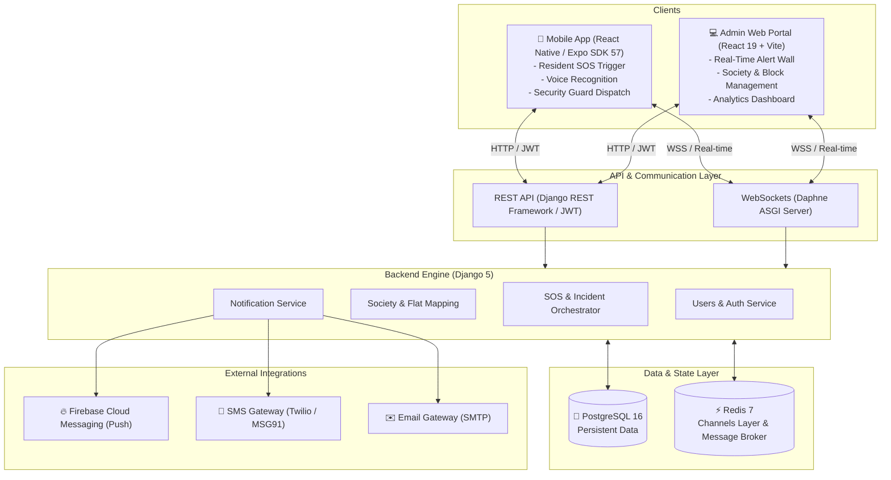

# 🛡️ CareConnect Platform

[](https://www.djangoproject.com/)
[](https://channels.readthedocs.io/)
[](https://react.dev/)
[](https://expo.dev/)
[](https://www.postgresql.org/)
[](https://redis.io/)
[](https://www.docker.com/)
[](https://tailwindcss.com/)

> **A real-time residential safety, emergency dispatch, and housing society management ecosystem connecting residents, security guards, and administrators in critical moments.**

---

## 📌 Table of Contents

- [Vision & Overview](#-vision--overview)
- [Key Features](#-key-features)
- [System Architecture](#-system-architecture)
- [Repository Structure](#-repository-structure)
- [Tech Stack](#-tech-stack)
- [Prerequisites](#-prerequisites)
- [Getting Started](#-getting-started)
  - [Option A: Quickstart with Docker Compose (Recommended)](#option-a-quickstart-with-docker-compose-recommended)
  - [Option B: Manual Local Setup (Step-by-Step)](#option-b-manual-local-setup-step-by-step)
- [Environment Variables Configuration](#-environment-variables-configuration)
- [API Documentation & Endpoints](#-api-documentation--endpoints)
- [User Roles & Workflow](#-user-roles--workflow)
- [Troubleshooting & FAQs](#-troubleshooting--faqs)
- [License & Author](#-license--author)

---

## 🌟 Vision & Overview

In gated communities and high-density apartment complexes, emergency response time is crucial. Traditional intercoms or phone calls to security gates are slow, lack real-time location accuracy, and fail during high-stress scenarios.

**CareConnect** solves this with a unified, 3-tier ecosystem:
1. **Resident & Guard Mobile App**: Gives residents instant, one-touch or hands-free voice-activated SOS triggers with live GPS coordinates, and equips on-duty security guards with real-time alerts.
2. **Society Web Admin Portal**: Equips management committees with real-time emergency monitoring, incident audit trails, guard dispatching, and resident KYC verification.
3. **High-Performance ASGI Backend**: An asynchronous Django + Daphne backend powered by WebSockets and Redis to broadcast alerts in sub-second latency across all devices.

---

## 🚀 Key Features

### 🚨 1. Real-Time SOS & Emergency Response
- **One-Tap Emergency Trigger**: Instant alert dispatch with user details, apartment number, and GPS coordinates.
- **Voice-Activated SOS**: Hands-free emergency trigger using on-device speech recognition (`expo-speech-recognition`).
- **Emergency Categorization**: Pre-configured categories (Medical, Fire, Security Intrusion, Lift Breakdown, Natural Disaster).
- **Live Bidirectional Incident Chat**: Real-time WebSocket communication room between the victim, responders, and admins.
- **Multi-Level Escalation Matrix**: Auto-escalates unacknowledged alerts from on-duty security to society managers and external emergency services.

### 🏢 2. Smart Society & Resident Management
- **Hierarchical Structuring**: Multi-society support structured by Society ➔ Towers/Blocks ➔ Flats.
- **KYC & Resident Onboarding**: Digital resident registration with proof document uploads and administrative approval workflows.
- **Role-Based Access Control (RBAC)**: Distinct permissions for `Admin`, `Security`, `Resident`, `Guardian`, and `Volunteer`.
- **Flat Mapping & Directory**: Complete mapping of residents, owners, and primary emergency contacts.

### 🔔 3. Multi-Channel Instant Alerts
- **Push Notifications**: Firebase Cloud Messaging (FCM) integration for instant push alerts even when the app is in the background.
- **SMS & Email Fallback**: Integrated support for Twilio / MSG91 SMS and SMTP email notifications for high-priority alerts.

### 📊 4. Admin Analytics & Incident Auditing
- **Live Incident Dashboard**: Real-time status cards (`Open`, `Active`, `Escalated`, `Resolved`, `Closed`).
- **Response Time Analytics**: Metrics and visual charts tracking mean time to respond (MTTR) and resolution outcomes.
- **Full Audit Trail**: Time-stamped logs of responder assignments, status changes, and resolution notes.

---

## 🏗️ System Architecture



---

## 📂 Repository Structure

```text
CareConnect/
├── admin-portal/              # 💻 Web Management Portal (React 19 + Vite + Tailwind CSS)
│   ├── src/
│   │   ├── api/               # Axios API client & interceptors
│   │   ├── pages/             # Dashboard, AlertMonitoring, SocietyManagement, etc.
│   │   ├── components/        # Reusable UI widgets & modals
│   │   └── services/          # Real-time WebSocket services
│   ├── .env.example           # Frontend environment configuration template
│   └── package.json
│
├── backend/                   # 🐍 Core ASGI Backend (Django 5 + Channels + DRF)
│   ├── config/                # Django project settings, asgi.py, wsgi.py, urls.py
│   ├── users/                 # Custom User model, JWT authentication, Resident Profiles
│   ├── society/               # Society, Block, Flat management & Resident mapping
│   ├── emergency/             # Emergency types, contacts, and escalation rules
│   ├── sos/                   # SOS triggers, Incident lifecycles, WebSocket consumers
│   ├── notifications/         # Multi-channel push/SMS/email dispatch engine
│   ├── Dockerfile             # Production-ready backend container definition
│   ├── requirements.txt       # Python dependencies
│   └── .env.example           # Backend environment configuration template
│
├── mobile-app/                # 📱 Mobile Application (React Native + Expo Router)
│   ├── src/
│   │   ├── app/               # Expo file-based router pages & tabs
│   │   ├── components/        # SOS button, emergency dials, live status badges
│   │   ├── hooks/             # Location tracking, voice recognition hooks
│   │   └── utils/             # Secure store, token management, WebSocket client
│   ├── .env.example           # Mobile app environment configuration template
│   └── package.json
│
├── docker-compose.yml         # 🐳 One-command stack orchestration (PostgreSQL, Redis, Daphne)
└── README.md                  # 📖 Project documentation
```

---

## 🛠️ Tech Stack

| Domain | Technology | Purpose |
| :--- | :--- | :--- |
| **Backend Framework** | **Django 5.x + Django REST Framework** | Core RESTful API & business logic |
| **Asynchronous & Realtime** | **Django Channels + Daphne (ASGI)** | High-concurrency WebSockets for live SOS & chat |
| **Database** | **PostgreSQL 16** | Relational data persistence |
| **Cache & Message Broker** | **Redis 7** | In-memory message layer for Django Channels |
| **Admin Portal** | **React 19 + Vite + Tailwind CSS v4** | Society administrator web application |
| **Mobile Application** | **React Native + Expo SDK 57** | Cross-platform (iOS/Android) resident & guard app |
| **Push Notifications** | **Firebase Admin SDK (FCM)** | Mobile push notification delivery |
| **Authentication** | **SimpleJWT (JSON Web Tokens)** | Stateless token-based auth with token blacklisting |
| **Containerization** | **Docker & Docker Compose** | Reproducible multi-service deployment |

---

## 📋 Prerequisites

Before running the project, ensure you have installed:
- **Git**
- **Docker & Docker Compose** (Recommended for easiest setup)
- *If running manually:*
  - **Python 3.11+**
  - **Node.js 18+ & npm**
  - **PostgreSQL 16**
  - **Redis 7**
  - **Expo CLI** (`npm install -g expo-cli`)

---

## 🏁 Getting Started

### Option A: Quickstart with Docker Compose (Recommended)

Docker Compose starts PostgreSQL, Redis, runs database migrations, collects static assets, and launches the Daphne ASGI server with a single command.

#### 1. Clone the repository
```bash
git clone https://github.com/DivyChaturvedi/CareConnect-Platform.git
cd CareConnect-Platform
```

#### 2. Configure Backend Environment
Copy the sample environment file in `backend`:
```bash
cp backend/.env.example backend/.env
```
*(On Windows PowerShell: `Copy-Item backend/.env.example backend/.env`)*

#### 3. Build & Launch the Services
```bash
docker compose up -d --build
```

#### 4. Verify Services
Check running containers:
```bash
docker compose ps
```
The following endpoints will now be accessible:
- **Backend API**: [http://localhost:8000/api/](http://localhost:8000/api/)
- **Interactive Swagger Docs**: [http://localhost:8000/swagger/](http://localhost:8000/swagger/)
- **ReDoc Documentation**: [http://localhost:8000/redoc/](http://localhost:8000/redoc/)
- **Django Admin Panel**: [http://localhost:8000/admin/](http://localhost:8000/admin/)

#### 5. Create a Superuser
```bash
docker compose exec backend python manage.py createsuperuser
```

---

### Option B: Manual Local Setup (Step-by-Step)

If you prefer to run services individually without Docker, follow these steps:

#### Step 1: Start PostgreSQL & Redis
Ensure your local PostgreSQL server is active and create a database named `careconnect_db`. Also ensure Redis is running on port `6379`.

---

#### Step 2: Setup Backend (Django & Daphne)

1. Navigate to the backend directory:
   ```bash
   cd backend
   ```

2. Create and activate a Python virtual environment:
   ```bash
   # Windows (PowerShell)
   python -m venv venv
   .\venv\Scripts\Activate.ps1

   # Linux / macOS
   python3 -m venv venv
   source venv/bin/activate
   ```

3. Install Python dependencies:
   ```bash
   pip install -r requirements.txt
   ```

4. Create `.env` file:
   ```bash
   cp .env.example .env
   ```
   *Edit `.env` and fill in your PostgreSQL credentials (`DB_PASSWORD`, `DB_USER`, etc.).*

5. Apply database migrations:
   ```bash
   python manage.py migrate
   ```

6. Create an administrator account:
   ```bash
   python manage.py createsuperuser
   ```

7. Start the ASGI Daphne server (handles both HTTP and WebSockets):
   ```bash
   daphne -b 127.0.0.1 -p 8000 config.asgi:application
   ```
   *(Alternatively for HTTP-only development: `python manage.py runserver`)*

---

#### Step 3: Setup Web Admin Portal (React + Vite)

1. Open a new terminal and navigate to the admin portal:
   ```bash
   cd admin-portal
   ```

2. Install dependencies:
   ```bash
   npm install
   ```

3. Configure environment variables:
   ```bash
   cp .env.example .env
   ```
   Default contents:
   ```env
   VITE_API_BASE_URL=http://localhost:8000
   VITE_WS_BASE_URL=ws://localhost:8000
   ```

4. Start the Vite development server:
   ```bash
   npm run dev
   ```
   Open your browser at **`http://localhost:5173`**.

---

#### Step 4: Setup Mobile Application (Expo / React Native)

1. Open a new terminal and navigate to the mobile app directory:
   ```bash
   cd mobile-app
   ```

2. Install dependencies:
   ```bash
   npm install
   ```

3. Configure environment variables:
   ```bash
   cp .env.example .env
   ```
   > ⚠️ **Note for Physical Devices & Emulators**: When testing on a real phone or emulator, do not use `localhost`. Use your computer's local network IP address (e.g. `192.168.1.100`):
   ```env
   EXPO_PUBLIC_API_BASE_URL=http://<YOUR_LOCAL_IP>:8000
   EXPO_PUBLIC_WS_BASE_URL=ws://<YOUR_LOCAL_IP>:8000
   ```

4. Start the Expo development server:
   ```bash
   npx expo start
   ```

5. Run on your device:
   - **Android / iOS Device**: Install the **Expo Go** app from Google Play or Apple App Store and scan the terminal QR code.
   - **Android Emulator**: Press `a` in the terminal.
   - **iOS Simulator**: Press `i` in the terminal (macOS only).

---

## ⚙️ Environment Variables Configuration

### Backend (`backend/.env`)
| Variable | Description | Example / Default |
| :--- | :--- | :--- |
| `DJANGO_SECRET_KEY` | Django cryptographic secret key | `django-insecure-your-secret-key` |
| `DJANGO_DEBUG` | Enable/disable debug mode | `True` |
| `DB_NAME` | PostgreSQL database name | `careconnect_db` |
| `DB_USER` | PostgreSQL user | `postgres` |
| `DB_PASSWORD` | PostgreSQL password | `your_secure_password` |
| `DB_HOST` | Database host address | `localhost` (or `db` in Docker) |
| `DB_PORT` | Database port | `5432` |
| `EMAIL_HOST` | SMTP server host | `smtp.gmail.com` |
| `EMAIL_PORT` | SMTP port | `587` |
| `EMAIL_HOST_USER` | SMTP username | `your-email@gmail.com` |
| `EMAIL_HOST_PASSWORD` | SMTP application password | `app-specific-password` |
| `TWILIO_ACCOUNT_SID` | *(Optional)* Twilio SID for SMS | `ACxxxxxxxxxxxxxx` |
| `TWILIO_AUTH_TOKEN` | *(Optional)* Twilio auth token | `your_twilio_token` |

### Admin Portal (`admin-portal/.env`)
| Variable | Description | Default |
| :--- | :--- | :--- |
| `VITE_API_BASE_URL` | Backend HTTP API root URL | `http://localhost:8000` |
| `VITE_WS_BASE_URL` | Backend WebSocket root URL | `ws://localhost:8000` |

### Mobile App (`mobile-app/.env`)
| Variable | Description | Default |
| :--- | :--- | :--- |
| `EXPO_PUBLIC_API_BASE_URL` | API URL reachable from device | `http://<YOUR_LAN_IP>:8000` |
| `EXPO_PUBLIC_WS_BASE_URL` | WebSocket URL reachable from device | `ws://<YOUR_LAN_IP>:8000` |

---

## 📡 API Documentation & Endpoints

CareConnect includes built-in interactive OpenAPI/Swagger documentation. Once the backend is running, visit:
- **Swagger UI**: `http://localhost:8000/swagger/`
- **ReDoc UI**: `http://localhost:8000/redoc/`

### Key Endpoints Summary

| Method | Endpoint | Description | Auth Required |
| :--- | :--- | :--- | :---: |
| `POST` | `/api/register/` | Register a new user (Resident, Guard, Admin) | No |
| `POST` | `/api/login/` | Authenticate user & retrieve JWT access/refresh tokens | No |
| `POST` | `/api/token/refresh/` | Refresh expired access token | No |
| `GET` | `/api/profile/` | Fetch logged-in user profile & resident verification | Yes (JWT) |
| `GET` | `/api/society/societies/` | List all registered residential societies | Yes (JWT) |
| `POST` | `/api/society/resident-approvals/` | Admin approval/rejection of resident mapping | Admin |
| `POST` | `/api/sos/alerts/` | **Trigger a new emergency SOS alert** | Resident |
| `GET` | `/api/sos/alerts/` | List active emergency alerts | Guard / Admin |
| `POST` | `/api/sos/alerts/{id}/respond/` | Security responder acknowledges alert | Guard / Admin |
| `POST` | `/api/sos/alerts/{id}/resolve/` | Mark incident as resolved with outcome log | Guard / Admin |
| `GET` | `/api/notifications/` | Retrieve user notification history | Yes (JWT) |
| `WS` | `/ws/chat/{alert_id}/?token={jwt}` | **Live bidirectional emergency room chat** | Responder / Resident |

---

## 👥 User Roles & Workflow

CareConnect coordinates multiple distinct user personas:

```text
[ Resident ] 
      │ 
      ├─► 1. Triggers SOS (Touch or Voice) with Live GPS
      │
[ On-Duty Security Guard ]
      │
      ├─► 2. Receives Instant Audio Alert & Screen Banner
      ├─► 3. Clicks "Respond", dispatches to Flat / Location
      ├─► 4. Opens Real-Time Incident Chat for updates
      │
[ Society Admin ]
      │
      ├─► 5. Monitors live progress on Admin Web Wall
      ├─► 6. Escalates to Ambulance / Police / Fire if unresolved
      │
[ Resolution ]
      └─► 7. Incident logged, outcome recorded, audit trail generated
```

1. **Resident (`RESIDENT`)**:
   - Registers profile and links flat/block to a registered society.
   - Triggers SOS in emergencies (Touch or Voice).
   - Engages in real-time chat with security during an active alert.
2. **Security Personnel (`SECURITY`)**:
   - Receives prioritized loud audio push alerts on the mobile app.
   - Acknowledges incident response and provides on-site support.
3. **Society Administrator (`ADMIN`)**:
   - Verifies resident documentation and approves flat occupancy.
   - Configures emergency categories and escalation matrix timeouts.
   - Monitors live emergency wall and audits past incidents.

---

## ❓ Troubleshooting & FAQs

### 1. Why do I get a WebSocket connection error on Mobile?
Ensure you are not using `localhost` in `mobile-app/.env`. Mobile devices and emulators cannot resolve `localhost` back to your computer. Use your machine's Wi-Fi / Local Area Network IP address (e.g. `192.168.x.x`). Also ensure your local firewall allows inbound connections on port `8000`.

### 2. Can I run the backend on traditional WSGI (like basic PythonAnywhere)?
No. CareConnect's real-time emergency dispatch relies on **Django Channels (ASGI)** and **Daphne** to manage WebSockets and asynchronous messaging. Standard synchronous WSGI hosts do not support WebSockets. For deployment, use containerized hosts or services with native ASGI/WebSocket support (such as Docker on a VPS, Fly.io, Railway, or AWS ECS).

### 3. How do I reset the database?
```bash
# Docker:
docker compose down -v
docker compose up -d --build

# Manual:
python manage.py flush
```

---

## 📄 License & Author

Distributed under the **MIT License**. See `LICENSE` for more information.

**Created by**: [Divy Chaturvedi](https://github.com/DivyChaturvedi)  
**Project Repository**: [https://github.com/DivyChaturvedi/CareConnect-Platform](https://github.com/DivyChaturvedi/CareConnect-Platform)
